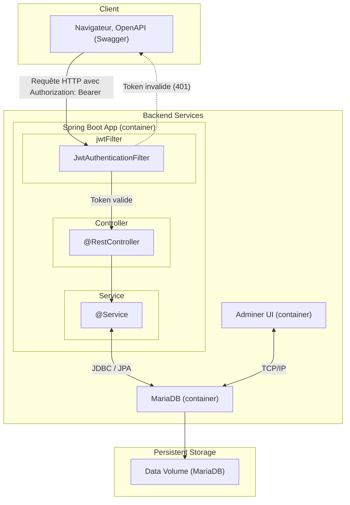

# 🎬 MovieApp

MovieApp projet d’orchestration qui regroupe l’ensemble des services de l’application (frontend, backend)

- **Frontend (movieapp-ui)** : Angular + Angular Material, déployé avec Nginx : [doc frontend](https://github.com/messaoudRm/movieapp-ui/blob/main/README.md)
- **Backend (movieapp-api)** : Spring Boot, exposant les services REST : [doc backend](https://github.com/messaoudRm/movieapp-api/blob/main/README.md)
- **Base de données** : MariaDB, initialisée automatiquement.
- **Adminer** : outil de gestion de la base accessible via navigateur.

---
## Architecture :

---
## 🚀 Lancement rapide

Assurez-vous d’avoir **Docker** installé, puis :

**Cloner le dépôt**
```bash
git clone https://github.com/messaoudRm/movieapp.git
cd movieapp
```

**Lancer l’application avec Docker Compose**

```bash
docker-compose up --build
```

## Arrêter et relancer l'application

Arrêter l'application :
  ```bash
  Ctrl + C
  ```

Relancer les conteneurs déjà créés :
  ```bash
  docker-compose start
  ```

## 🧹 Nettoyer les conteneurs, images et volumes

Arrêter et supprimer uniquement les conteneurs :
  ```bash
  docker-compose down
  ```

Supprimer les images Docker utilisées :
  ```bash
  docker rmi movieapp-frontend movieapp-backend mariadb:11.8.2 adminer
  ```

Supprimer le volume de la base de données :
  ```bash
  docker volume rm movieapp_movieapp-db-data
  ```


