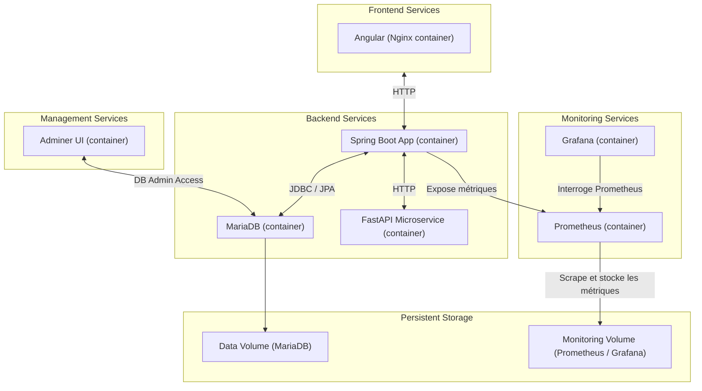

# 🎬 MovieApp

MovieApp projet d’orchestration qui regroupe l’ensemble des services de l’application (frontend, backend)


- **Frontend (movieapp-ui)** : Angular + Angular Material, déployé avec Nginx : [doc frontend](https://github.com/messaoudRm/movieapp-ui)
- **Backend (movieapp-api)** : Spring Boot, exposant les services REST : [doc backend](https://github.com/messaoudRm/movieapp-api)
  - **Base de données** : MariaDB, initialisée automatiquement.
  - **Adminer** : outil de gestion de la base accessible via navigateur.
- **Monitoring (movieapp-monitoring)**: stack de monitoring basée sur Prometheus et Grafana : [doc monitoring](https://github.com/messaoudRm/movieapp-monitoring)
- **Sentiment Analyzer (movieapp-sentiment-analyzer)** : microservice FastAPI dédié à l’analyse de sentiment des commentaires : [doc Sentiment-Analyzer](https://github.com/messaoudRm/sentiment-analyzer)
- **Vector Search (movieapp-vector-search)** : Moteur de recherche sémantique de films basé sur pgvector et FastAPI contenerisé en microservice : [doc Vector Search](https://github.com/messaoudRm/movieapp-vector-search)
- **Selenium E2E Tests (movieapp-e2e)** : Tests E2E Selenium pour MovieApp : [doc movieapp-e2e](https://github.com/messaoudRm/movieapp-e2e)
---
## Architecture :


---

## Lancement rapide

Assurez-vous d’avoir **Docker** installé, puis :

**Cloner le dépôt**
```bash
git clone https://github.com/messaoudRm/movieapp.git
cd movieapp
```

**Lancer l’application avec Docker Compose**

```bash
docker-compose up --build
```

## Supprimer les conteneurs, images et volumes

  ```bash
  docker-compose down --rmi all -v 
  ```
